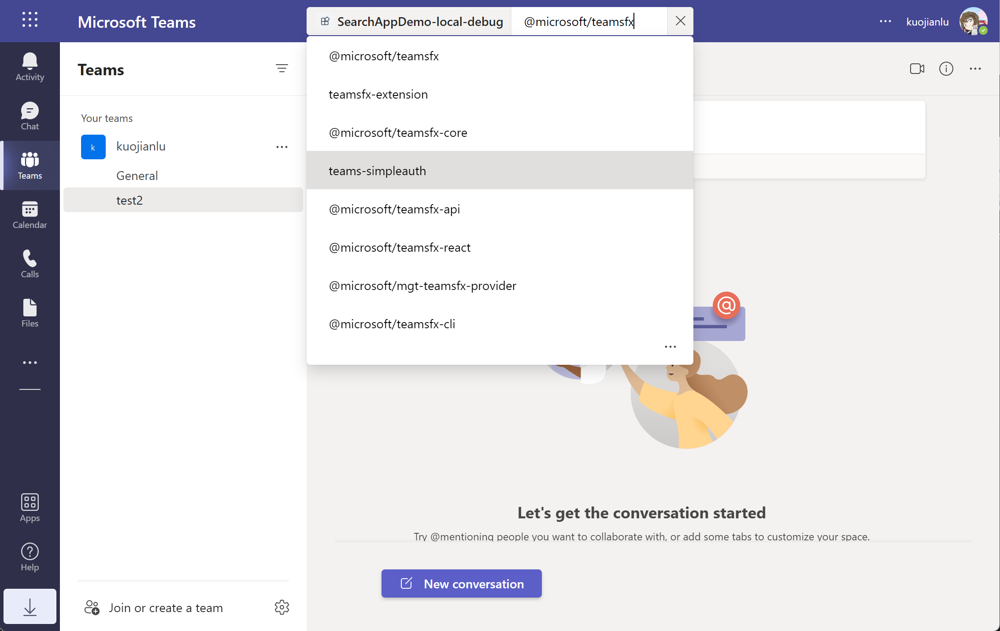
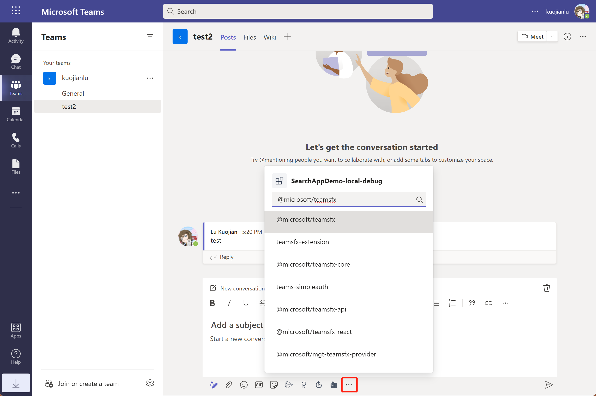
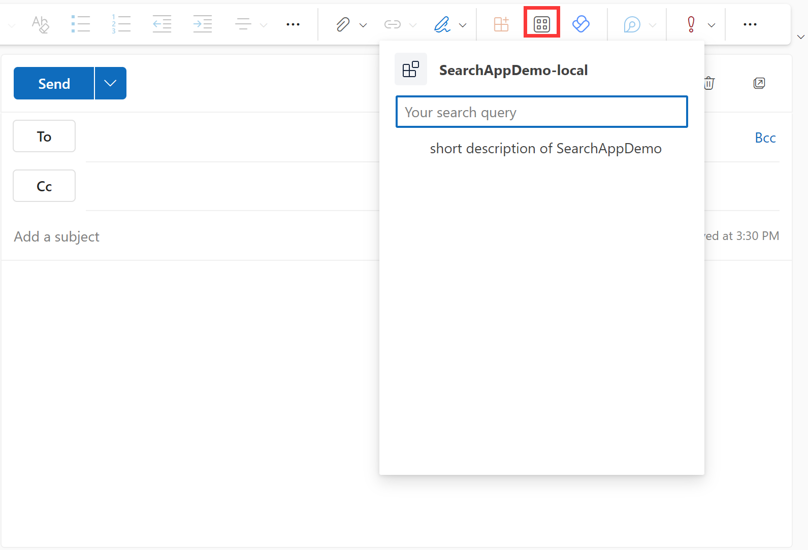

# Getting Started with Npm Search Connector Sample

> Note: We really appreciate your feedback! If you encounter any issue or error, please report issues to us following the [Supporting Guide](https://github.com/OfficeDev/TeamsFx-Samples/blob/dev/SUPPORT.md). Meanwhile you can make [recording](https://aka.ms/teamsfx-record) of your journey with our product, they really make the product better. Thank you!
>  
> This warning will be removed when the samples are ready for production.

NPM Search Connector is a Message Extension that allows you to perform a quick search to NPM Registry for a package and insert package details into conversations for sharing with your co-workers. The front end is built with Adaptive Cards to render NPM package details and the backend is an Azure Bot Service handling search queries and communication between the server workload and the clients, including Teams and Outlook (Web Client).

## Prerequisite
- [Node.js](https://nodejs.org/en/), supported versions: 14, 16, 18
- An [Azure subscription](https://azure.microsoft.com/en-us/free/)
- [Set up your dev environment for extending Teams apps across Microsoft 365](https://aka.ms/teamsfx-m365-apps-prerequisites)

## What you will learn in this sample:
- How to build message extension bot on Azure for your app.
- How to use Teams Toolkit to build a message extension app that runs across Microsoft 365 including Teams and Outlook (Web)

## Try the Sample with Visual Studio Code Extension:
> Here are the instructions to run the sample in **Visual Studio Code**. You can also try to run the app using TeamsFx CLI tool, refer to [Try the Sample with TeamsFx CLI](cli.md)
1. Clone the repo to your local workspace or directly download the source code.
2. Download [Visual Studio Code](https://code.visualstudio.com) and install [Teams Toolkit Visual Studio Code Extension](https://aka.ms/teams-toolkit).
3. Open the project in Visual Studio Code.
4. Open the command palette and select `Teams: Provision in the cloud`.
5. Once provision is completed, open the command palette and select `Teams: Deploy to the cloud`.
6. Once deployment is completed, you can preview the app running in Azure. In Visual Studio Code, open the `Run and Debug` Activity Panel. Select a target Microsoft application where the app runs: `Launch Remote in Teams` or `Launch Remote in Outlook`. If you select `Launch Remote in Outlook`, a VS Code dialog will be popped up as the image below. Please click "Install in Teams" first to install the app in Teams, then click "Continue" to continue to preview the app in Outlook.
  

## (Optional) Debug
1. In Visual Studio Code, open the `Run and Debug` Activity Panel, select `Debug in Teams` or `Debug in Outlook`. If you select `Debug in Outlook`, a VS Code dialog will be popped up as the image below. Please click "Install in Teams" first to install the app in Teams, then click "Continue" to continue to debug the app in Outlook.
  

## Use the app in Teams
To trigger the message extension in Teams, there are multiple entry points:
- `@mention` your message extension, from the search box area.
  
- `@mention` your message extension from the compose message area.
  
- Click the `...` under compose message area, find your message extension.
  

## Use the app in Outlook Web Client
To trigger the message extension in Outlook:
- Click the "More apps" icon under compose email area, find your message extension.
  

## Architecture
### Code structure
- You can check app configuration and environment information in: [.fx](.fx)
- You will find bot code in: [bot](bot)

## Code of Conduct
This project has adopted the [Microsoft Open Source Code of Conduct](https://opensource.microsoft.com/codeofconduct/).

For more information see the [Code of Conduct FAQ](https://opensource.microsoft.com/codeofconduct/faq/) or
contact [opencode@microsoft.com](mailto:opencode@microsoft.com) with any additional questions or comments.