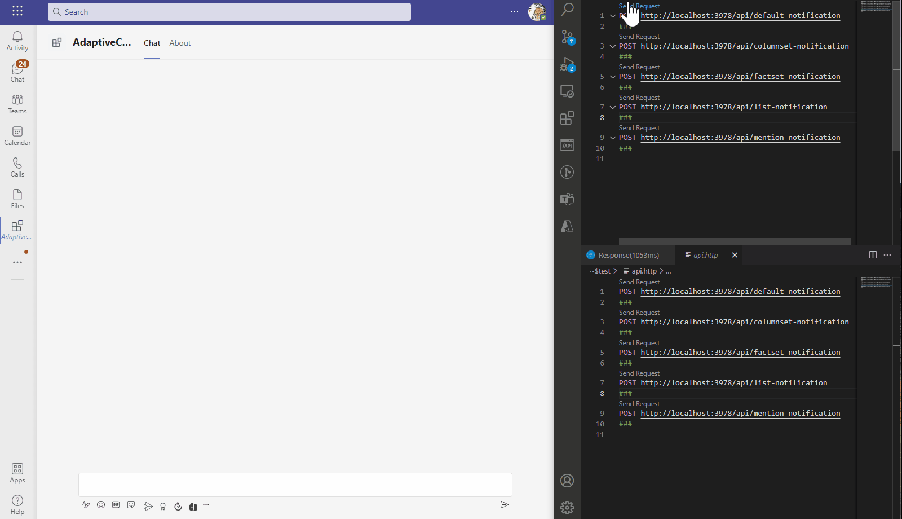
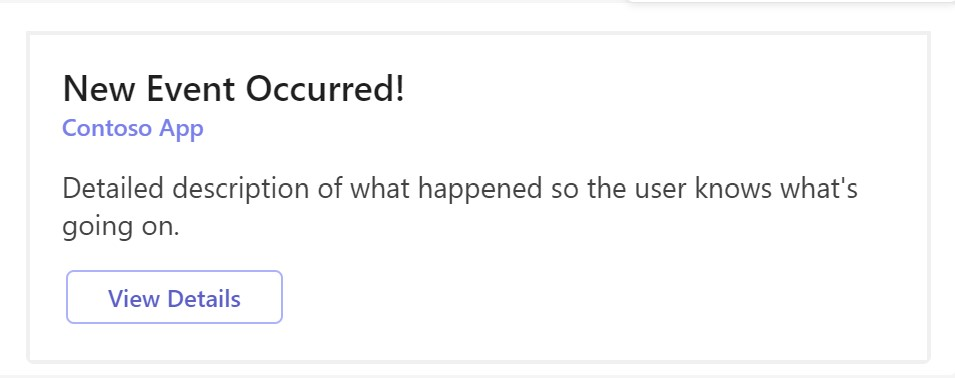

# Getting Started with Adaptive Card Notification

Adaptive Card Notification provides an easy way to send notification in Teams. The front end is built with Adaptive Cards to render notification details, the bot framework service is an Azure Bot Service handling search queries and communication between the server workload and the client and the backend is hosted in Azure Functions providing notification trigger and message handler.



## This sample illustrates
- Use Teams Toolkit to build notification bot.
- Use Adaptive Cards to send notification in Teams.

## Prerequisite to use this sample
- [Node.js](https://nodejs.org/), supported versions: 14, 16, 18 (preview)
- A Microsoft 365 tenant in which you have permission to upload Teams apps. You can get a free Microsoft 365 developer tenant by joining the [Microsoft 365 developer program](https://developer.microsoft.com/en-us/microsoft-365/dev-program).
- [Teams Toolkit for VS Code](https://aka.ms/teams-toolkit) or [TeamsFx CLI](https://aka.ms/teamsfx-cli)
- An [Azure subscription](https://azure.microsoft.com/en-us/free/)

## Minimal path to awesome
>Here are the instructions to run the sample in **Visual Studio Code**. You can also try to run the app using TeamsFx CLI tool, refer to [Try the Sample with TeamsFx CLI](cli.md)

### Run the app locally
1. Clone the repo to your local workspace or directly download the source code.
1. Download [Visual Studio Code](https://code.visualstudio.com) and install [Teams Toolkit Visual Studio Code Extension](https://aka.ms/teams-toolkit).
1. Open the project in Visual Studio Code.
1. Open Debug View (`Ctrl+Shift+D`) and select "Debug (Edge)" or "Debug (Chrome)" in dropdown list.
1. Press "F5" to open a browser window and then select your package to view adaptive card notification sample app. 
1. Get the endpoint of the trigger. For debug, `<endpoint>` is `http://localhost:3978` by default. It can be found in `BOT_ENDPOINT` of the file `env/.env.local`.
1. Send a POST request to the http trigger, you will receive the adaptive card message in Teams. The trigger can be addressable with the following route:
    - Default adaptive card: `<endpoint>/api/default-notification`
    - Columnset adaptive card: `<endpoint>/api/columnset-notification`
    - Factset adaptive card: `<endpoint>/api/factset-notification`
    - List adaptive card: `<endpoint>/api/list-notification`
    - Adaptive card that mentioned a particular user: `<endpoint>/api/mention-notification`

### Deploy the app to Azure
1. Open Teams Toolkit, and sign into Azure by clicking the `Sign in to Azure` under the `ACCOUNTS` section from sidebar.
1. Open the command palette and select `Teams: Provision in the cloud`. 
1. Once provision is completed, open the command palette and select `Teams: Deploy to the cloud`.

### Preview the app in Teams
1. Once deployment is completed, you can preview the app running in Azure. In Visual Studio Code, open `Run and Debug` and select `Launch Remote (Edge)` or `Launch Remote (Chrome)` in the dropdown list and Press `F5` or green arrow button to open a browser.
2. Get the endpoint of the trigger. The `<endpoint>` can be found in `BOT_ENDPOINT` of the file `env/.env.dev`.
3. Send a POST request to the http trigger, you will receive the adaptive card message in Teams. The trigger can be addressable with the following route:
    - Default adaptive card: `<endpoint>/api/default-notification`
    - Columnset adaptive card: `<endpoint>/api/columnset-notification`
    - Factset adaptive card: `<endpoint>/api/factset-notification`
    - List adaptive card: `<endpoint>/api/list-notification`
    - Adaptive card that mentioned a particular user: `<endpoint>/api/mention-notification`

## Advanced usage of this sample
1. Update the `userId` and `userName` to the user who you want to mention in the file [mentionNotificationHttpTrigger.ts](src/mentionNotificationHttpTrigger.ts).
   ```js
    const data: MentionData = {
    ......
    userId: "<user-id>",
    userName: "<user-name>",
    ......
    };
    ```
1. Use Azure Blob Storage to persist notification connections
   This sample provides an implementation of `NotificationTargetStorage` at `src/storage/blobsStorage.ts`, which connects to Azure Blob Storage to persist notification connections.

   To try it, uncomment the `notification.storage` settings of your bot in `src/internal/initialize.ts`, then enter your own connection string and container name.
    ``` typescript
    ...
      notification: {
        enabled: true,
        storage: new BlobsStorage("{your-connection-string}", "{your-container-name}"),
      },
    ...
    ```
1. Author an adaptive card
    - The default adaptive card template is in [notification-default.json](bot/src/adaptiveCards/notification-default.json). For more details of the adaptive card schema, you can refer to https://adaptivecards.io/explorer/AdaptiveCard.html.
      
    - The columnset adaptive card template is in [notification-columnset.json](bot/src/adaptiveCards/notification-columnset.json). For more details of the adaptive card schema, you can refer to https://adaptivecards.io/explorer/ColumnSet.html.
      
    - The list adaptive card is in [notification-list.json](bot/src/adaptiveCards/notification-list.json). For more details of the adaptive card schema, you can refer to https://adaptivecards.io/explorer/ColumnSet.html.
      
    - The factset adaptive card template is in [notification-factset.json](bot/src/adaptiveCards/notification-factset.json). For more details of the adaptive card schema, you can refer to https://adaptivecards.io/explorer/FactSet.html.
      
    - The mention adaptive card template is in [notification-mention.json](bot/src/adaptiveCards/notification-mention.json). For more details of the adaptive card schema, you can refer to https://docs.microsoft.com/microsoftteams/platform/task-modules-and-cards/cards/cards-format?tabs=adaptive-md%2Cconnector-html#mention-support-within-adaptive-cards.
      

## Version History
| Date         | Author       | Comments                               |
| ------------ | ------------ | -------------------------------------- |
| May 23, 2022 | XiaofuHuang  | update to support Teams Toolkit V4.0.0 |
| Dec 12, 2022 | XiaofuHuang  | update to support Teams Toolkit v5.0.0 |

## Feedback
We really appreciate your feedback! If you encounter any issue or error, please report issues to us following the [Supporting Guide](https://github.com/OfficeDev/TeamsFx-Samples/blob/dev/SUPPORT.md). Meanwhile you can make [recording](https://aka.ms/teamsfx-record) of your journey with our product, they really make the product better. Thank you!
