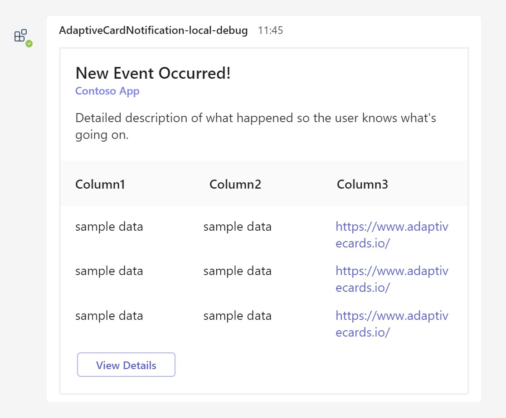
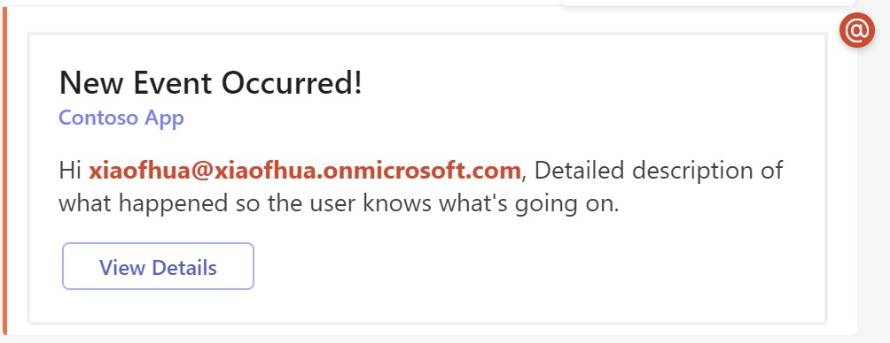

# Getting Started with Adaptive Card Notification Sample (Azure)

> Note: Please be advised that this sample repository is currently in **Public Preview**, with a lot of active development work taking place. Please expect breaking changes as we continue to iterate. 
> 
> We really appreciate your feedback! If you encounter any issue or error, please report issues to us following the [Supporting Guide](./../SUPPORT.md). Meanwhile you can make [recording](https://aka.ms/teamsfx-record) of your journey with our product, they really make the product better. Thank you!
>  
> This warning will be removed when the samples are ready for production.

Adaptive Card Notification provides an easy way to send notification in Teams. The front end is built with Adaptive Cards to render notification details, the bot framework service is an Azure Bot Service handling search queries and communication between the server workload and the client and the backend is hosted in Azure Functions providing notification trigger and message handler.

## Prerequisite
- [NodeJS](https://nodejs.org/en/), fully tested on NodeJS 12, 14
- An M365 account. If you do not have M365 account, apply one from [M365 developer program](https://developer.microsoft.com/en-us/microsoft-365/dev-program)
- Latest [Teams Toolkit Visual Studio Code Extension](https://aka.ms/teams-toolkit) **version >= 3.x.x** or [TeamsFx CLI](https://aka.ms/teamsfx-cli) **version >= 0.x.x**
- An [Azure subscription](https://azure.microsoft.com/en-us/free/)

## What you will learn in this sample:
- How to build notification bot on Azure for your app.
- How to send Adaptive Cards in Teams

## Try the Sample with Visual Studio Code Extension:
>Here are the instructions to run the sample in **Visual Studio Code**. You can also try to run the app using TeamsFx CLI tool, refer to [Try the Sample with TeamsFx CLI](cli.md)
1. Clone the repo to your local workspace or directly download the source code.
1. Download [Visual Studio Code](https://code.visualstudio.com) and install [Teams Toolkit Visual Studio Code Extension](https://aka.ms/teams-toolkit).
1. Open the project in Visual Studio Code.
1. Open the command palette and select `Teams: Provision in the cloud`. 
1. Once provision is completed, open the command palette and select `Teams: Deploy to the cloud`.
1. Once deployment is completed, you can preview the app running in Azure. In Visual Studio Code, open `Run and Debug` and select `Launch Remote (Edge)` or `Launch Remote (Chrome)` in the dropdown list and Press `F5` or green arrow button to open a browser.

## (Optional) Debug
1. Open Debug View (`Ctrl+Shift+D`) and select "Debug (Edge)" or "Debug (Chrome)" in dropdown list.
1. Press "F5" to open a browser window and then select your package to view adaptive card notification sample app. 

## Use the App in Teams
1. Get the endpoint of the trigger. For debug, `<endpoint>` is `http://localhost:3978` by default. For preview, the `<endpoint>` can be found in `fx-resource-bot.siteEndpoint` of the file `.fx/states/state.{env}.json`.
1. (Optional) Update the `userId` and `userName` to the user who you want to mention in the file [mentionNotificationHttpTrigger.ts](bot/src/mentionNotificationHttpTrigger.ts), you will receive an adaptive card message that mentioned a particular user.
    ```js
    const data: MentionData = {
    ......
    userId: "<user-id>",
    userName: "<user-name>",
    ......
    };
    ```
1. Send a POST request to the http trigger, you will receive the adaptive card message in Teams. The trigger can be addressable with the following route:
    - Default adaptive card: `<endpoint>/api/default-notification`
    - Columnset adaptive card: `<endpoint>/api/columnset-notification`
    - Factset adaptive card: `<endpoint>/api/factset-notification`
    - List adaptive card: `<endpoint>/api/list-notification`
    - Adaptive card that mentioned a particular user: `<endpoint>/api/mention-notification`

## Author an adaptive card
- The default adaptive card template is in [notification-default.json](bot/src/adaptiveCards/notification-default.json). For more details of the adaptive card schema, you can refer to https://adaptivecards.io/explorer/AdaptiveCard.html.
  
- The columnset adaptive card template is in [notification-columnset.json](bot/src/adaptiveCards/notification-columnset.json). For more details of the adaptive card schema, you can refer to https://adaptivecards.io/explorer/ColumnSet.html.
  
- The list adaptive card is in [notification-list.json](bot/src/adaptiveCards/notification-list.json). For more details of the adaptive card schema, you can refer to https://adaptivecards.io/explorer/ColumnSet.html.
  
- The factset adaptive card template is in [notification-factset.json](bot/src/adaptiveCards/notification-factset.json). For more details of the adaptive card schema, you can refer to https://adaptivecards.io/explorer/FactSet.html.
  
- The mention adaptive card template is in [notification-mention.json](bot/src/adaptiveCards/notification-mention.json). For more details of the adaptive card schema, you can refer to https://docs.microsoft.com/microsoftteams/platform/task-modules-and-cards/cards/cards-format?tabs=adaptive-md%2Cconnector-html#mention-support-within-adaptive-cards.
  

## Architecture
- The notification is hosted on [Azure Function](https://docs.microsoft.com/en-us/azure/azure-functions/) for triggering a notification.
- The Backend server is hosted on [Azure Function](https://docs.microsoft.com/en-us/azure/azure-functions/) for receiving bot messages.

### Code structure
- You can check app configuration and environment information in: [.fx](.fx)
- You will find bot code in: [bot](bot)
- You will find adaptive cards template in: [adaptiveCards](bot/src/adaptiveCards)

## Code of Conduct
This project has adopted the [Microsoft Open Source Code of Conduct](https://opensource.microsoft.com/codeofconduct/).

For more information see the [Code of Conduct FAQ](https://opensource.microsoft.com/codeofconduct/faq/) or
contact [opencode@microsoft.com](mailto:opencode@microsoft.com) with any additional questions or comments.
