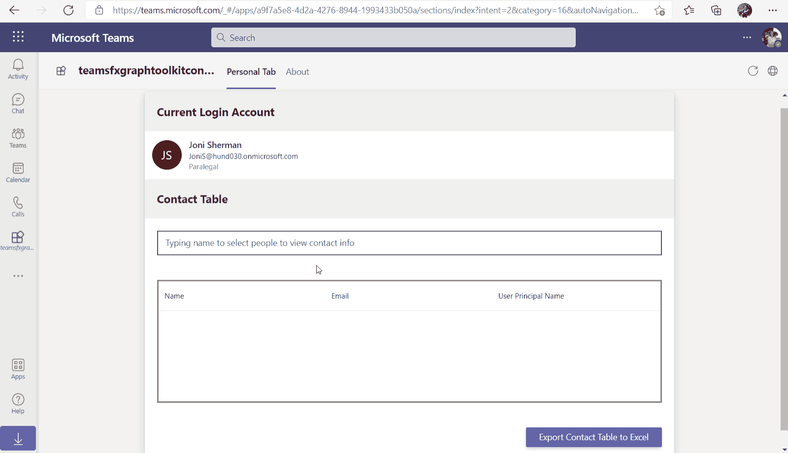
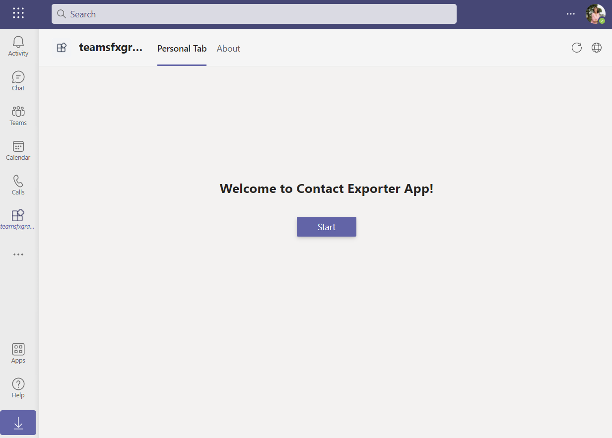
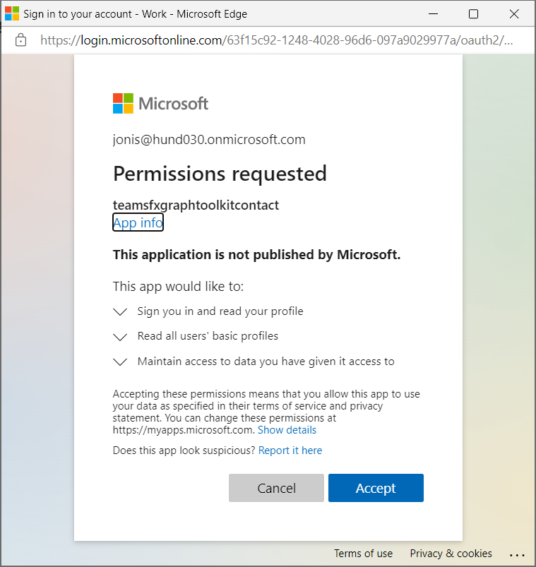
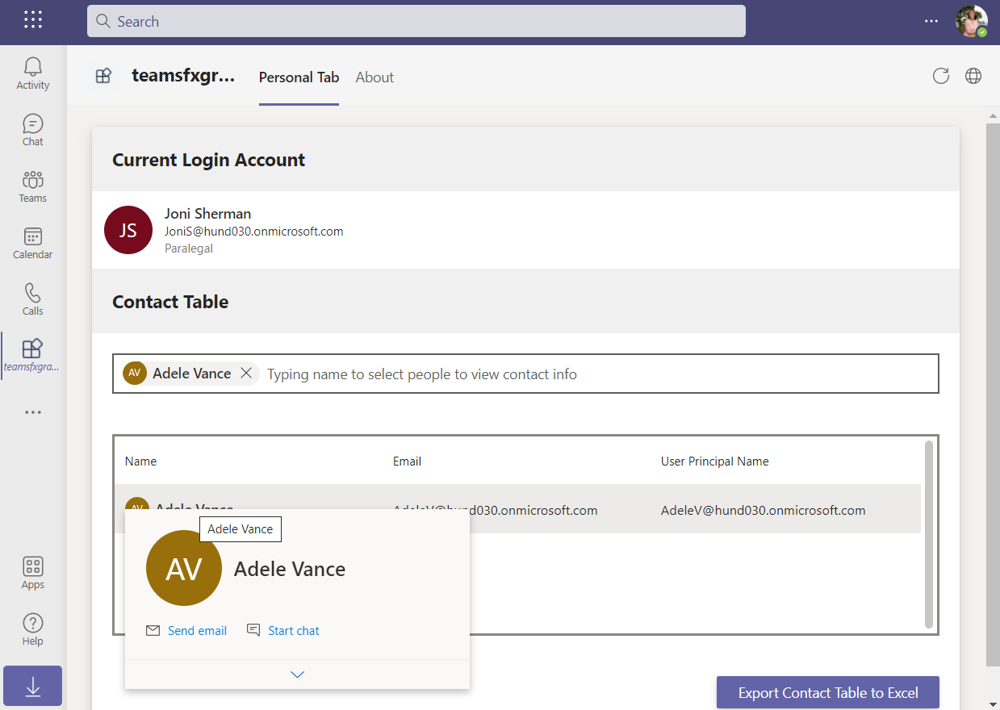

# Getting Started with Contact Exporter Sample

> Note: We really appreciate your feedback! If you encounter any issue or error, please report issues to us following the [Supporting Guide](https://github.com/OfficeDev/TeamsFx-Samples/blob/dev/SUPPORT.md). Meanwhile you can make [recording](https://aka.ms/teamsfx-record) of your journey with our product, they really make the product better. Thank you!
>  
> This warning will be removed when the samples are ready for production.

Contact Exporter sample APP provides an easy way to export your teams contact info to Excel file. This APP is using [Microsoft Graph Toolkit](https://docs.microsoft.com/en-us/graph/toolkit/overview) as UI component. Please be advised that [mgt-teamsfx-provider](https://www.npmjs.com/package/@microsoft/mgt-teamsfx-provider) library is currently in preview stage, please expect breaking changes in the future release.



## Prerequisite
- [Node.js](https://nodejs.org/en/), supported versions: 14, 16, 18
- A Microsoft 365 account. If you do not have Microsoft 365 account, apply one from [Microsoft 365 developer program](https://developer.microsoft.com/en-us/microsoft-365/dev-program)
- Latest [Teams Toolkit Visual Studio Code Extension](https://aka.ms/teams-toolkit)


## What you will learn in this sample:
- How to use TeamsFx to build frontend hosting on Azure for your tab app.
- How to integration TeamsFx with Microsoft Graph Toolkit library.

## Try the Sample with Visual Studio Code Extension:

### Local Debug the Sample
1. Clone the repo to your local workspace or directly download the source code.
1. Download [Visual Studio Code](https://code.visualstudio.com) and install [Teams Toolkit Visual Studio Code Extension](https://aka.ms/teams-toolkit).
1. Open the project in Visual Studio Code.
1. Open Debug View (`Ctrl+Shift+D`) and select "Debug (Edge)" or "Debug (Chrome)" in dropdown list.
1. Press "F5" to open a browser window and then select your package to view contact exporter sample app. 

### Provision and Deploy the Sample to Azure
> If you don't have an Azure subscription, create [a free account](https://azure.microsoft.com/en-us/free/) before you begin
1. Open the command palette and select `Teams: Provision in the cloud`. You will be asked to select Azure resource group to provision the sample.
1. Once provision is completed, open the command palette and select `Teams: Deploy to the cloud`.
1. Once deployment is completed, you can preview the APP running in Azure. In Visual Studio Code, open `Run and Debug` and select `Launch Remote (Edge)` or `Launch Remote (Chrome)` in the dropdown list and Press `F5` or green arrow button to open a browser.

## Try the Sample with TeamsFx CLI
> If you don't have an Azure subscription, create [a free account](https://azure.microsoft.com/en-us/free/) before you begin
1. Install [Node.js](https://nodejs.org/en/download/) (use the latest v14 LTS release)
1. To install the TeamsFx CLI, use the npm package manager:
    ```
    npm install -g @microsoft/teamsfx-cli
    ```
1. Clone this sample project.
1. In the sample project folder, run provision command.
    ```
    teamsfx provision
    ```
1. Deploy the sample project.
    ```
    teamsfx deploy
    ```
1. Once your deployment is completed, You can open the project in Visual Studio Code, open `Run and Debug` and select `Launch Remote (Edge)` or `Launch Remote (Chrome)` in the dropdown list and Press `F5` or green arrow button to open a browser.

## Use the APP in Teams
1. The APP will look like this when it runs for the first time.

    
1. For the first time to run the app, you need to consent the APP to use Microsoft Graph API and Graph Toolkit. Click on "Accept" button to accept the Authorization.

    
1. You could try to typing name to select person to view the contact info.

    
1. You could try to move your mouse to user name to view the personal card of the user.

    
1. You could try to click 'Export Contact Table to Excel' button to export contact info to Excel.