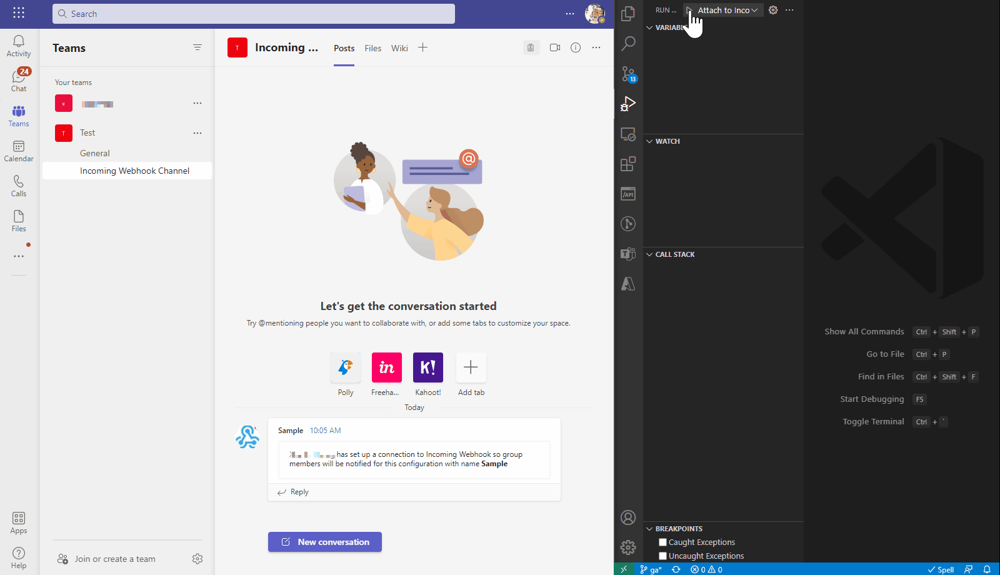

# Getting Started with Incoming Webhook Notification Sample

> Note: We really appreciate your feedback! If you encounter any issue or error, please report issues to us following the [Supporting Guide](https://github.com/OfficeDev/TeamsFx-Samples/blob/dev/SUPPORT.md). Meanwhile you can make [recording](https://aka.ms/teamsfx-record) of your journey with our product, they really make the product better. Thank you!
>  
> This warning will be removed when the samples are ready for production.

An Incoming Webhook Sample provides an easy way to send adaptive cards in Microsoft Teams channels. The webhooks are used as tools to track and notify.


## Prerequisite
- [Node.js](https://nodejs.org/en/), supported versions: 14, 16, 18
- A [Teams Channel](https://docs.microsoft.com/en-us/microsoftteams/teams-channels-overview)

## What you will learn in this sample:
- How to create an Incoming Webhook in Teams
- How to send Adaptive Cards in Teams

## Try the Sample with Visual Studio Code:
1. [Add an incoming webhook in Teams](https://docs.microsoft.com/en-us/microsoftteams/platform/webhooks-and-connectors/how-to/add-incoming-webhook#create-an-incoming-webhook-1). 
1. Clone the repo to your local workspace or directly download the source code.
1. Replace the placeholder `<webhook-url>` with the webhook URL in `./incoming-webhook/src/index.ts`
    ```ts
    const webhookUrl: string = "<webhook-url>";
    ```
1. Execute the command `npm install`, `npm run build` and `npm run start` under the `./incoming-webhook` folder. 
1. In the Teams channel, you can find the Adaptive Cards sent from the Incoming Webhook Sample. 


## (Optional) Debug
>Here are the instructions to debug the sample in **Visual Studio Code**.
1. Download [Visual Studio Code](https://code.visualstudio.com).
1. Open the project in Visual Studio Code.
1. [Add an incoming webhook in Teams](https://docs.microsoft.com/en-us/microsoftteams/platform/webhooks-and-connectors/how-to/add-incoming-webhook#create-an-incoming-webhook-1) and replace the placeholder `<webhook-url>` with the webhook URL in `./incoming-webhook/src/index.ts`.
1. Open Debug View (`Ctrl+Shift+D`) and select "Attach to Incoming Webhook" in dropdown list.

## Architecture
### Code structure
- You will find the incoming webhook code in: [incoming-webhook/](incoming-webhook/)
- You will find the adaptive card template in [incoming-webhook/src/adaptiveCards](incoming-webhook/src/adaptiveCards)

## Code of Conduct
This project has adopted the [Microsoft Open Source Code of Conduct](https://opensource.microsoft.com/codeofconduct/).

For more information see the [Code of Conduct FAQ](https://opensource.microsoft.com/codeofconduct/faq/) or
contact [opencode@microsoft.com](mailto:opencode@microsoft.com) with any additional questions or comments.