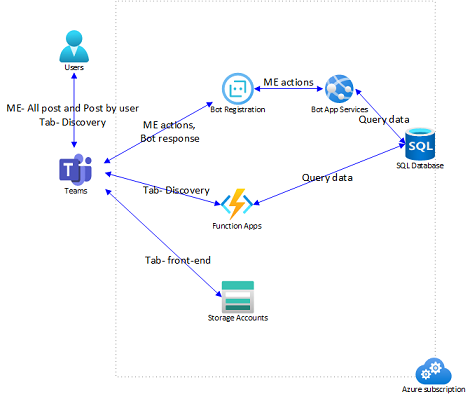
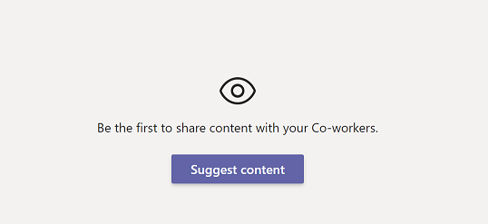
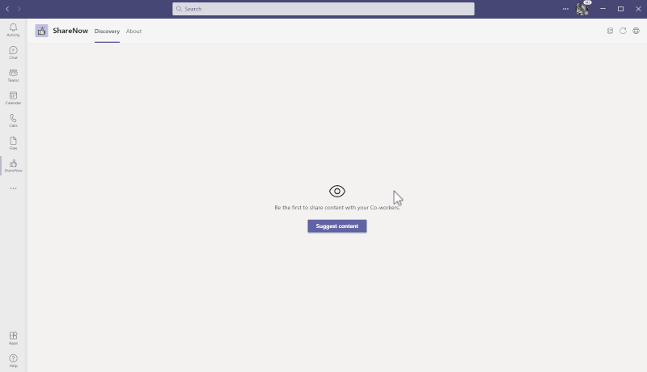

# Getting Started with Share Now Sample - React Tab , Azure backend and message extension bot with Azure SQL DB

> ## WARNING: This repository is under active development and the samples are not guaranteed to work!
> This warning will be removed when the samples are ready for consumption

## Basic sample for Tab app:



### This sample app is a personal tab and message extension bot used to manage , search and share posts.

- The frontend is a react tab hosting on [Azure Storage](https://docs.microsoft.com/en-us/azure/storage/).
- Backend server is hosting on [Azure Function](https://docs.microsoft.com/en-us/azure/azure-functions/) and define the logic to manage posts.
- The message extension bot is hosting on [Azure Function](https://docs.microsoft.com/en-us/azure/bot-service/) and define the logic to search and share posts. 
- And there is a [SQL DB](https://docs.microsoft.com/en-us/azure/azure-sql/) on Azure to persist data so that each time user open the tab can retrieve the same data.

### What you will learn in this sample:
- How to build frontend hosting on Azure for your tab app.
- How to build backend hosting on Azure for your tab app.
- How to build message extension bot on Azure for your app.
- How to connect to Azure SQL DB and how to do CRUD operations in DB.

### Running this Sample App:

1. Clone the repo to your local workspace or directly download the source code.
1. Download [Visual Studio Code](https://code.visualstudio.com) and install 'Teams Toolkit' extension.
1. Open the project in Visual Studio Code.
1. Open Command Palette (`Ctrl+Shift+P`) and type `Teams: Provision in the Cloud`.
1. Once provisioning is complete, open Command Palette (`Ctrl+Shift+P`) and type `Teams: Deploy to the Cloud`.
1. Open [.fx/env.default.json](.fx/env.default.json) file, you could get the database name in `databaseName` setting. In Azure portal, find the database and use [query editor](https://docs.microsoft.com/en-us/azure/azure-sql/database/connect-query-portal) with below query to create tables:
    ```sql
    CREATE TABLE [TeamPostEntity](
	    [PostID] [int] PRIMARY KEY IDENTITY,
	    [ContentUrl] [nvarchar](400) NOT NULL,
	    [CreatedByName] [nvarchar](50) NOT NULL,
	    [CreatedDate] [datetime] NOT NULL,
	    [Description] [nvarchar](500) NOT NULL,
	    [IsRemoved] [bit] NOT NULL,
	    [Tags] [nvarchar](100) NULL,
	    [Title] [nvarchar](100) NOT NULL,
	    [TotalVotes] [int] NOT NULL,
	    [Type] [int] NOT NULL,
	    [UpdatedDate] [datetime] NOT NULL,
	    [UserID] [uniqueidentifier] NOT NULL,
    )
    GO
    CREATE TABLE [UserVoteEntity](
	    [VoteID] [int] PRIMARY KEY IDENTITY,
	    [PostID] [int] NOT NULL,
	    [UserID] [uniqueidentifier] NOT NULL,
    )
    GO
    ```
1. Once deployment is complete, open Debug View (`Ctrl+Shift+D`) and select "Launch Remote (Edge)" or "Launch Remote (Chrome)" in dropdown list.
1. Press "F5" to open a browser window and then select your package to view todo list sample app. 

### Debug [Optional]

1. [Create an Azure SQL Database](https://docs.microsoft.com/en-us/azure/azure-sql/database/single-database-create-quickstart?tabs=azure-portal)
1. Use [query editor](https://docs.microsoft.com/en-us/azure/azure-sql/database/connect-query-portal) with below query to create tables:
    ```sql
    CREATE TABLE [TeamPostEntity](
	    [PostID] [int] PRIMARY KEY IDENTITY,
	    [ContentUrl] [nvarchar](400) NOT NULL,
	    [CreatedByName] [nvarchar](50) NOT NULL,
	    [CreatedDate] [datetime] NOT NULL,
	    [Description] [nvarchar](500) NOT NULL,
	    [IsRemoved] [bit] NOT NULL,
	    [Tags] [nvarchar](100) NULL,
	    [Title] [nvarchar](100) NOT NULL,
	    [TotalVotes] [int] NOT NULL,
	    [Type] [int] NOT NULL,
	    [UpdatedDate] [datetime] NOT NULL,
	    [UserID] [uniqueidentifier] NOT NULL,
    )
    GO
    CREATE TABLE [UserVoteEntity](
	    [VoteID] [int] PRIMARY KEY IDENTITY,
	    [PostID] [int] NOT NULL,
	    [UserID] [uniqueidentifier] NOT NULL,
    )
    GO
    ```
1. Open [.fx/local.env](.fx/local.env) file, and set the values of below config with the Azure SQL Database you just created:
    ```
    BACKEND_SQL_ENDPOINT=
    BACKEND_SQL_DATABASE_NAME=
    BACKEND_SQL_USER_NAME=
    BACKEND_SQL_PASSWORD=

    BOT_SQL_ENDPOINT=
    BOT_SQL_DATABASE_NAME=
    BOT_SQL_USER_NAME=
    BOT_SQL_PASSWORD=
    ```
1. Open Debug View (`Ctrl+Shift+D`) and select "Debug (Edge)" or "Debug (Chrome)" in dropdown list.
1. Press "F5" to open a browser window and then select your package to view todo list sample app. 

### How to use this Sample App:

1. The app should be running like this:

    

1. You could try to add new content by clicking "Suggest content" button, inputing information and submitting it.
1. You could try to update content created by you by clicking "..." and then choose "update" button.
1. You could try to delete content created by you by clicking "..." and then choose "delete" button.
1. You could try to add/delete your vote for the content by click the icon  in the content.
1. You could try to search all/posted-by-me contents in compose box or command box by filtering based on title or tags of content and share with your colleagues.

    

### Code structure:

- You can check app configuration and environment information in: [.fx](.fx)
- You will find frontend code in: [tabs/src/components](tabs/src/components)
- You will find backend code in: [api/posts](api/posts), [api/vote](api/vote)
- You will find bot code in: [bot](bot)
- You will find DB Connection code in: [api/utils/common.ts](api/utils/common.ts)
