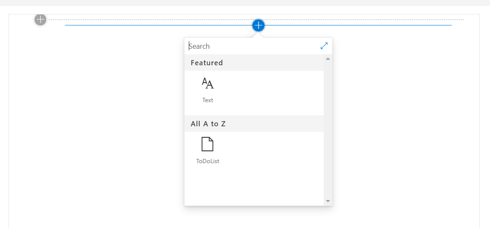

# Getting Started with Todo Sample - React Tab on SPFx

## TeamsFx Todo Sample for Tab App

### This sample app is a personal tab used to manage To-do List

- The frontend is a React Tab hosted on [SharePoint](https://docs.microsoft.com/en-us/sharepoint/dev/spfx/build-for-teams-overview).
- Backend server(including the database) is provided by [SharePoint List](https://support.microsoft.com/en-us/office/introduction-to-lists-0a1c3ace-def0-44af-b225-cfa8d92c52d7) 

### What you will learn in this sample

- How to call Microsoft Graph client in SPFx context to get access to M365 data.
- How to create SharePoint List in the website and how to do CRUD operations on SharePoint List in SPFx context.
- How to deploy your app to SharePoint App Catalog and sync the solution to Teams App Catalog.

### Set up SharePoint Enviroment and Create SharePoint List

1. Set up M365 tenant and SharePoint App Catalog site, see [reference](https://docs.microsoft.com/en-us/sharepoint/dev/spfx/set-up-your-developer-tenant).
2. Create a new site or use an existing site in SharePoint.
3. Create a SharePoint List, and enter name "To Do List".
    - Note:In this project, the Teams App can only automatically detect your SharePoint root site(https://{your-tenant-name}.sharepoint.com/), so pls create the list in the SharePoint root site. If you want to create it in the subsite, you need to change the site url in [./src/webparts/TodoList/components/SharePointListManager.ts](./src/webparts/TodoList/components/SharePointListManager.ts) by yourself.
4. Add 'description' column (type: 'Single line of text') in the list.
5. Add 'isCompleted' column (type: 'Yes/No') in the list, default value to 'No'.
6. [Optional] If you want your users to only see the items created by themselves.
    - In List Page, click `setting` button and then choose `list setting`.
    
    - In `Advanced Settings`, Set the `Read Access` to `Read items that were created by the user`, and Set the `Create and Edit access` to `Create items and edit items that were created by the user`.
    
    - Click 'Ok' to save your setting.

### Running this Sample App
1. <b>Install the latest version of [Node.js LTS 14.x]</b>(https://nodejs.org/en/download/releases/)(Note: SPFx v1.12.1 support Node.js v10/12/14)
2. Clone the repo to your local workspace or directly download the source code.
3. You can either download [Visual Studio Code](https://code.visualstudio.com) and install Teams Toolkit V2 or download TeamsFx CLI.
4. Open [./SPFx/src/webparts/TodoList/components/SharePointListManager.ts](./SPFx/src/webparts/TodoList/components/SharePointListManager.ts), navigate to line:16, set the listname variable to your SharePoint List name.
5. [Optional]Debug the app with SharePoint WorkBench in VSCode.
    - Navigate to [launch.json](.vscode/launch.json), replace `enter-your-SharePoint-site` with your SharePoint site.
    - In Debug mode, select "Hosted workbench" and press start button. The Hosted Workbench will be opened and you may need to sign in with your M365 account.
    - Click the plus button in the middle, and select `TodoList`, the webpart will show up in the workbench.
    - 
6. Open the project with VSCode and in the Teams Toolkit V2 sidebar, click `Provision in the Cloud` under PROJECT.

    Or you can use TeamsFx CLI with running this cmd under your project path:
    `teamsfx provision`

    It will provision an app in Teams App Studio. You may need to login with your M365 tenant admin account.

7. Build and Deploy your SharePoint Package.
    - Click `Deploy to the Cloud` in Teams Toolkit V2 sidebar, or run `Teams: Deploy to the Cloud` from command palette. This will generate a SharePoint package(*.sppkg) under sharepoint/solution folder.
  
    Or you can use TeamsFx CLI with running this cmd under your project path:
        `teamsfx deploy`

    - Upload or drag and drop the *.sppkg to the SharePoint App Catalog site, please follow the instruction: [Deploy the HelloWorld package to App Catalog](https://docs.microsoft.com/en-us/sharepoint/dev/spfx/web-parts/get-started/serve-your-web-part-in-a-sharepoint-page#deploy-the-helloworld-package-to-app-catalog)
8. After Deploy, you may need to go to the SharePoint Admin Site. In `Advanced - API Access`,  approve you API request.

9. Go back to Teams Toolkit V2, and in the sidebar, click `Publish to Teams`. 

    Or you can use TeamsFx CLI with running this cmd under your project path:
        `teamsfx publish`

You will find your app in [Microsoft Teams admin center](https://admin.teams.microsoft.com/policies/manage-apps). Enter your app name "toDoList" in the search box.

Click the item(should be the second one in the above picture) and select `Publish` in the Publishing status.

10. You may need to wait for a few minutes after publishing your teams app.And then login to Teams, and you will find your app in the `Apps - Built for {your-tenant-name}` category.

### How to use this Sample App:
1. Since SharePoint can get the context so app user doesn't need to do consent/login operation.
2. You could try to add new todo item by typing item and click "Add" button.
3. You could try to complete todo item by choosing the checkbox before the item.
4. You could try to update todo item by typing text in todo item list.
5. You could try to delete todo item by clicking "..." and then choose "delete" button.
    
    [*Note: The SPFx APP UI is a bit different from teams UI(see known issue)]
### Code structure:

- You will find frontend code in: [src/webparts/TodoList](src/webparts/TodoList)

### References

- [Getting started with SharePoint Framework](https://docs.microsoft.com/en-us/sharepoint/dev/spfx/set-up-your-developer-tenant)
- [Building for Microsoft teams](https://docs.microsoft.com/en-us/sharepoint/dev/spfx/build-for-teams-overview)
- [Use Microsoft Graph in your solution](https://docs.microsoft.com/en-us/sharepoint/dev/spfx/web-parts/get-started/using-microsoft-graph-apis)
- [Publish SharePoint Framework applications to the Marketplace](https://docs.microsoft.com/en-us/sharepoint/dev/spfx/publish-to-marketplace-overview)
- [Microsoft 365 Patterns and Practices](https://aka.ms/m365pnp) - Guidance, tooling, samples and open-source controls for your Microsoft 365 development

### Known Issue:
1.Importing [msteams-ui-components-react](https://www.npmjs.com/package/msteams-ui-components-react) package will cause issues during package build:

