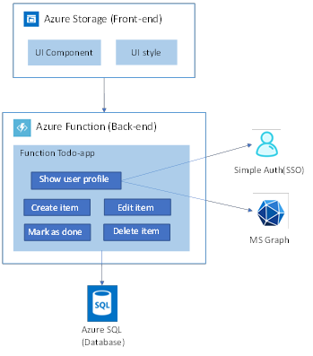
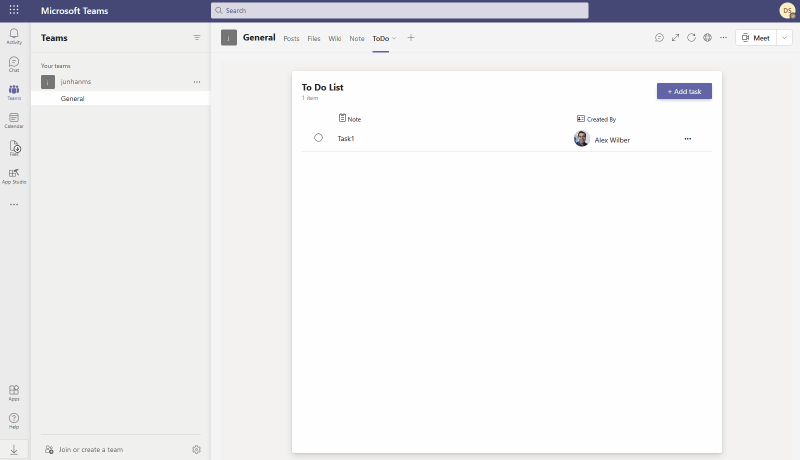

# Getting Started with Todo List Sample - React Tab and Azure backend with Azure SQL DB

> ## WARNING: This repository is under active development and the samples are not guaranteed to work!
> This warning will be removed when the samples are ready for consumption

### This sample app is a group tab used to manage To-do List.

- The frontend is a react tab hosting on [Azure Storage](https://docs.microsoft.com/en-us/azure/storage/).
- Backend server is hosting on [Azure Function](https://docs.microsoft.com/en-us/azure/azure-functions/) and define the logic to manage todo list. 
- And there is a [SQL DB](https://docs.microsoft.com/en-us/azure/azure-sql/) on Azure to persist data so that each time user open the tab can retrieve the same data.

### Architecture



### What you will learn in this sample:

- How to use TeamsFx to build frontend hosting on Azure for your tab app.
- How to use TeamsFx to build backend hosting on Azure for your tab app.
- How to connect to Azure SQL DB and how to do CRUD operations in DB.
- How to use MS graph client in TeamsFx to get access to M365 data.
- How to use TeamsFx simple auth capability to get Teams user login information.

### Running this Sample App:

1. Clone the repo to your local workspace or directly download the source code.
1. Download [Visual Studio Code](https://code.visualstudio.com) and install 'Teams Toolkit' extension.
1. Open the project in Visual Studio Code.
1. Open Command Palette (`Ctrl+Shift+P`) and type `Teams: Provision in the Cloud`.
1. Once provisioning is complete, open Command Palette (`Ctrl+Shift+P`) and type `Teams: Deploy to the Cloud`.
1. Open [.fx/env.default.json](.fx/env.default.json) file, you could get the database name in `databaseName` setting. In Azure portal, find the database and use [query editor](https://docs.microsoft.com/en-us/azure/azure-sql/database/connect-query-portal) with below query to create a table:
    ```sql
    CREATE TABLE Todo
    (
        id INT IDENTITY PRIMARY KEY,
        description NVARCHAR(128) NOT NULL,
        objectId NVARCHAR(36),
        channelOrChatId NVARCHAR(128),
        isCompleted TinyInt NOT NULL default 0,
    )
    ```
1. Once deployment is complete, open Debug View (`Ctrl+Shift+D`) and select "Launch Remote (Edge)" or "Launch Remote (Chrome)" in dropdown list.
1. Press "F5" to open a browser window and then select your package to view todo list sample app. 

### Debug [Optional]

1. [Create an Azure SQL Database](https://docs.microsoft.com/en-us/azure/azure-sql/database/single-database-create-quickstart?tabs=azure-portal)
1. Use [query editor](https://docs.microsoft.com/en-us/azure/azure-sql/database/connect-query-portal) with below query to create a table:
    ```sql
    CREATE TABLE Todo
    (
        id INT IDENTITY PRIMARY KEY,
        description NVARCHAR(128) NOT NULL,
        objectId NVARCHAR(36),
        channelOrChatId NVARCHAR(128),
        isCompleted TinyInt NOT NULL default 0,
    )
    ```
1. Open [.fx/local.env](.fx/local.env) file, and set the values of below config with the Azure SQL Database you just created:
    ```
    BACKEND_SQL_ENDPOINT=
    BACKEND_SQL_DATABASE_NAME=
    BACKEND_SQL_USER_NAME=
    BACKEND_SQL_PASSWORD=
    ```
1. Open Debug View (`Ctrl+Shift+D`) and select "Debug (Edge)" or "Debug (Chrome)" in dropdown list.
1. Press "F5" to open a browser window and then select your package to view todo list sample app. 

### How to use this Sample App:

1. The app should be running like this, and you could click the start button:

    

2. For the first time to run the app, you need to consent the app to get your profile information like your avatar. Click on "Accept" button to accept the Authorization.

    

3. You could try to add new todo item by typing item and click "Add" button.
4. You could try to complete todo item by choosing the checkbox before the item.
5. You could try to update todo item by typing text in todo item list.
6. You could try to delete todo item by clicking "..." and then choose "delete" button.

    

### Code structure:

- You can check app configuration and environment information in: [.fx](.fx)
- You will find frontend code in: [tabs/src/components](tabs/src/components)
- You will find backend code in: [api/todo](api/todo)
- You will find DB Connection code in: [api/todo/index.js](api/todo/index.js)
- You will find MS graph client code in: [tabs/src/components/Creator.js](tabs/src/components/Creator.js)
